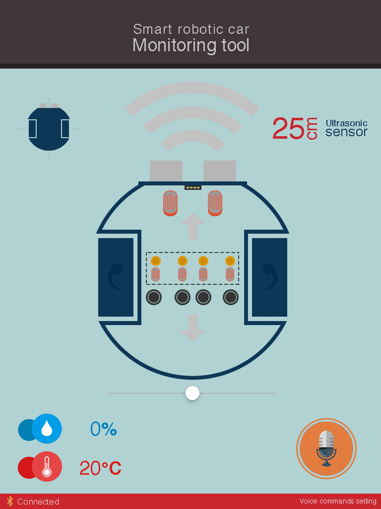
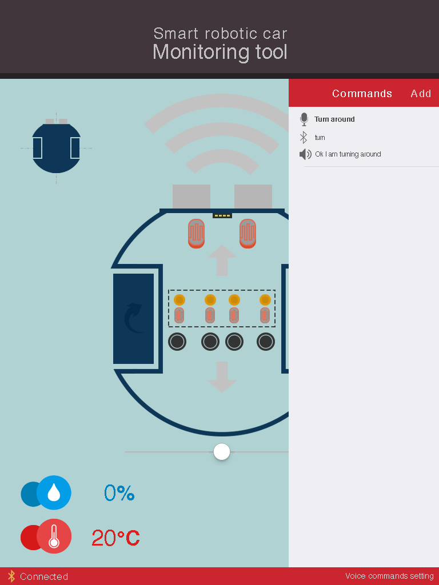
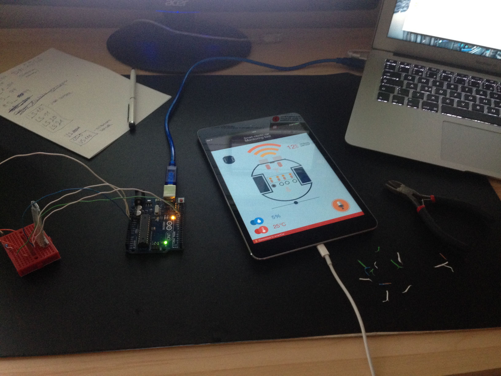

# SmallRoboticCar
High school project from 2015. iOS application controlling small robotic car via Bluetooth 4.0 communication and offline voice command recognition.

### HW
- ATmega328
- HM-10 Bluetooth 4.0 module
- Circle design - 2 wheels driven by separate DC motors
- Line following sensor (PCB design, DIY manufacturing)
- Multiple sensors 

### iOS application
- Monitoring live values from the sensors
  - Humidity
  - Temperature
  - Ultrasonic sensor (distance)
  - Line following sensor - reading from all 4 photo-resistors (line present / not present)
- Controlling movement of the robot (forward/backward/left/right/rotation left/rotation right)
- Management of the voice commands - offline recognition
  - Command (what the OpenEars framework listens to)
  - Information sent (what data is sent by Bluetooth 4.0 to the robot, when command recognized)
  - Response (response in english)
  
&nbsp;

  
  
  

